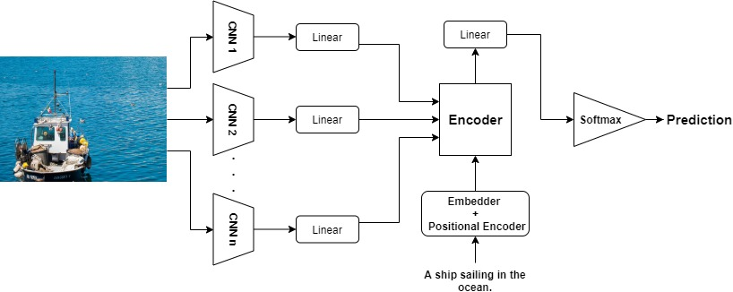
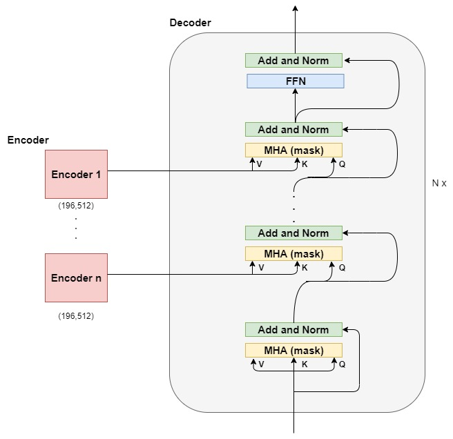
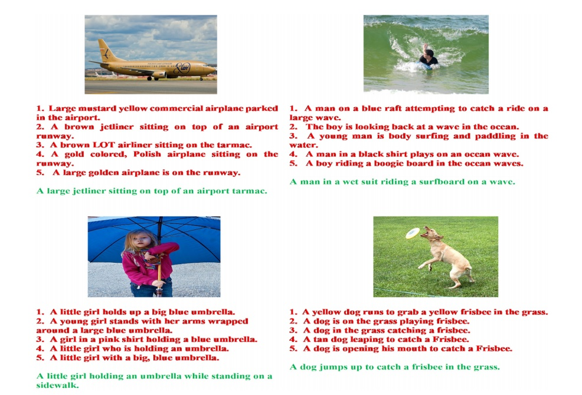

# GlosysIC Framework
<p align="center">
  
</p>

<b style='color:red'>red words</b>

This repository is our implementation of our MIKE 2019 paper: <br>
### GlosysIC Framework: Transformer for Image Captioning with Sequential Attention MIKE 2019

## Abstract
Over the past decade, the field of Image captioning has witnessed a lot AQ1
of intensive research interests. This paper proposes “GlosysIC Framework: Transformer for Image Captioning with Sequential Attention” to build a novel framework that harnesses the combination of Convolutional Neural Network (CNN) to
encode image and transformer to generate sentences. Compared to the existing
image captioning approaches, GlosysIC framework serializes the Multi head attention modules with the image representations. Furthermore, we present GlosysIC
architectural framework encompassing multiple CNN architectures and attention
based transformer for generating effective descriptions of images. The proposed
system was exhaustively trained on the benchmark MSCOCO image captioning
dataset using RTX 2060 GPU and V100 GPU from Google Cloud Platform in terms
of PyTorch Deep Learning library. Experimental results illustrate that GlosysIC
significantly outperforms the previous state-of-the-art models.

## Architecture
<p align="center">
  
</p>

## Requirements
* torch>=1.2.0 <br>
* torchvision>=0.3.0 <br>

## Steps to run
1. Download the datasets (Preprocessed COCO dataset) for training from [here] (https://drive.google.com/drive/u/1/folders/1Aey60cZR_mBrVfBVOOSd-OFcR_FnToUB) and place them in the $(Root)/datasets directory. (The dataset given in the link is just a subset of the entire dataset. If you require the entire data, drop us a message and we'll provide them to you) <br>
2. (Optional) Edit the training parameters from base_model.py.
3. To start the training process, run:
```.bash
python train.py
```
4. To generate caption on custom test image, run:
```.bash
python caption.py --image "image.jpg"
```

## Results
<p align="center">
  
```diff
  + Green: Generated Captions 
  - Red: Ground Truth Captions 
```
</p>

## Evaluation
<table align='center'>
  <tr>
    <th>Model</th>
    <th>BLEU-1</th>
    <th>BLEU-2</th>
    <th>BLEU-3</th>
    <th>BLEU-4</th>
    <th>CIDEr</th>
    <th>ROUGE-L</th>
    <th>METEOR</th>    
  </tr>
  <tr>
    <td>GlosysIC</td>
    <td>72.5</td>
    <td>53.4</td>
    <td>38.7</td>
    <td>28.15</td>
    <td>94.0</td>
    <td>54.0</td>
    <td>25.8</td>    
  </tr>
</table>
<p align="center">
<b>Our model's scores on various evaluation metrics. </b><br>
</p>

## Final Note
The generated captions capture intricate details of the image are well generated. <br>
Go ahead..pull it, train it and have fun. And don't forget to :star:<b><i>star</i></b>:star: the repo, if you like it. :smile:

-------------------------------------
<p align="center">
:star2: Happiness should be a function without any parameters :star2: <br> <br>
<b>Happy Coding</b> :exclamation: :exclamation:
</p>
